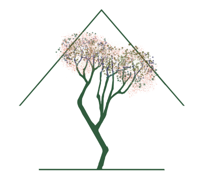
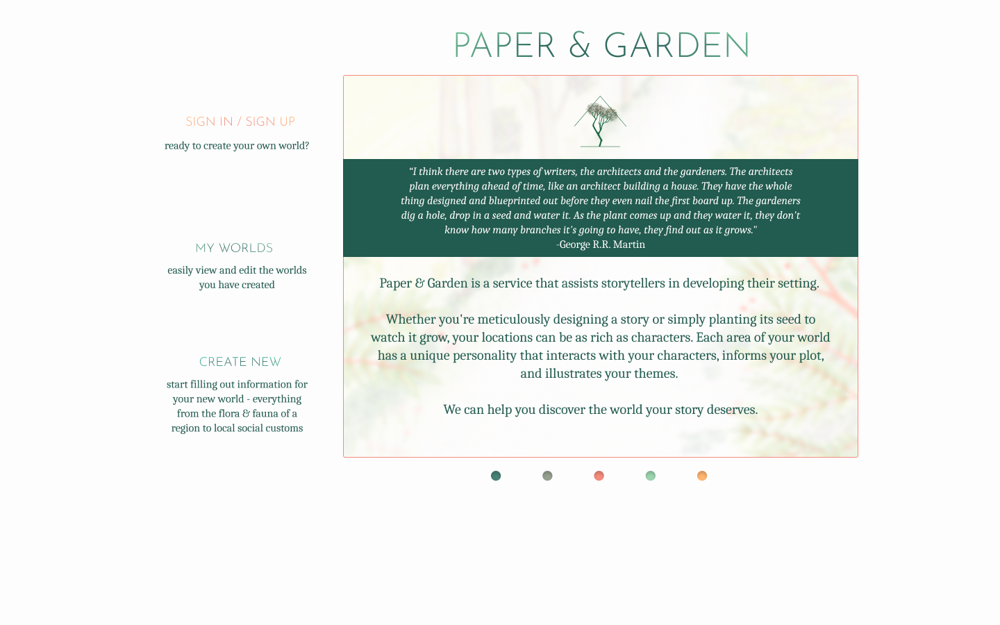
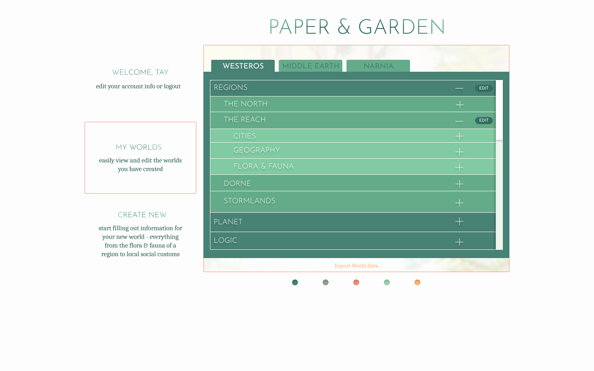
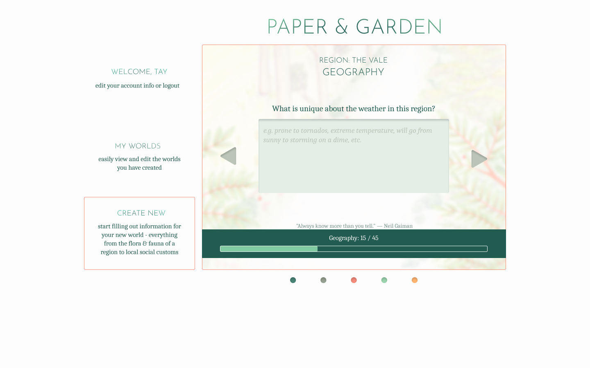

# Paper & Garden
## *A World Building Resource for Storytellers*

*Whether you're meticulously designing a story or simply planting its seed to watch it grow, your locations can be as rich as characters. Each area of your world has a unique personality that interacts with your characters, informs your plot, and illustrates your themes.*

*We can help you discover the world your story deserves.*

---

### Introduction
This ongoing personal project is an app for storytellers (novelists, screenwriters, etc.) to assist in world-building. I wanted to use this project as an opportunity to explore features new to me using vanilla React and CSS rather than utilizing libraries. 

Paper & Garden is a full-stack web application that takes in input about a fictional world and saves the information to a user's account.

### [Live Demo](http://papergarden.tay-made.com)
### [Figma](https://www.figma.com/file/hN1TvqZse7avr7pcmeWt5r/Paper%26Garden?node-id=0%3A11)

### What does the app do?
* Paper & Garden offers a user-friendly way to develop fictional worlds.
* It was built for creators to save and expand upon the worlds of their fiction.
* Users are able to fill out information based on the prompts and reference them during the writing process.

### Tech stack
* Language: JavaScript
* Frontend: React, CSS, Next.js, axios
* Server: Serverless
* Database: MongoDB
* Testing: Cypress.io

### Challenges
* Designing a simple, aesthetically pleasing, easily accessible UI
* Creating custom hooks to create a fully-functional form without utilizing a pre-made library.
* Researching how writers develop worlds in order to understand user needs and develop user stories.
* Optimizing user’s ability to create multiple worlds, multiple regions within each world, and multiple cities within each region with a scalable database.
* Using as few pre-made frameworks and tools as possible, in order to create many features from scratch for the purpose of understanding better how they work - and because it was more fun to have that extra challenge (listen, I have an odd definition of fun)

### Minimum Viable Product:
* User can submit data and retrieve that data
* Front end is accessible and mobile responsive
* Back end is designed for future scalability

  
  
  

### How does the app work?
* When the user logs in, the information is validated via axios get request.
* When the user creates a new world, an axios post request sends the data to the Mongo database without a server.
* When the user fills out a form, the information is saved in state via a custom React hook.
* When the user submits a form answer by pressing the "next" button, the information about the world they create is automatically saved to the database.

### Required Research
* Though the original project was to accomplish the MVP of the concept, I will be using a Feature Branch Workflow as it evolves.
* I implement Agile Practices to organize and execute this project.

### Future Plans
* Full form functionality with increased usability
* "My Worlds" view incorporates accordion drawer design
* "Sign in with Google" authentication
* Stress-Testing and prepping for increased traffic as features evolve
* Sharpening the usability of the interface
* Users are able to edit their worlds after submission
* Input pulls in information from a natural resources API and auto-fills flora, fauna, weather information, etc.
* Users are able to share their worlds, to editors, background artists, illustrators, DMs, etc.
* Sister apps for character development and plot development that integrate with the world storytellers have created
* And much more!
